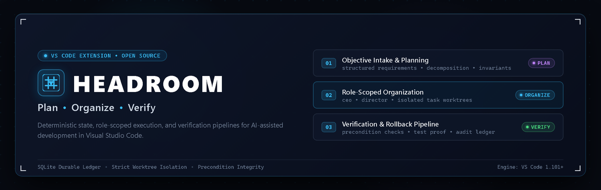
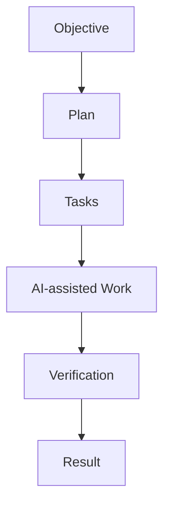

# HEADROOM

<p align="center">
  
</p>

<p align="center">
  <strong>HEADROOM is a Visual Studio Code extension built to make AI-assisted software development more organized, practical, and reliable. It brings planning, task management, AI agents, project context, tools, and verification together in one development workflow.</strong>
</p>

<p align="center">
  <a href="https://github.com/shreyansh316/Code_Cruxu/issues">Issues</a> ·
  <a href="https://github.com/shreyansh316/Code_Cruxu/releases">Releases</a> ·
  <a href="./CONTRIBUTING.md">Contributing</a> ·
  <a href="./docs/ai-github-collaboration.md">Multi-AI Guide</a>
</p>

---

> [!NOTE]
> **Project Status**: HEADROOM is an active open-source development project. Features, APIs, and workflows are continuously evolving. The current version (`v0.1.0`) is an early development preview.

---

## What is HEADROOM?

HEADROOM is a local-first development system that transforms how developers work with AI coding models inside Visual Studio Code.

Rather than relying on unstructured chat streams or granting unrestricted access to run raw commands across a repository, HEADROOM structures software engineering into disciplined, verifiable workflows:

* **Objectives replace ad-hoc prompts**: Define overarching engineering goals that are analyzed and broken into structured plans.
* **Plans decompose into dependency-aware tasks**: Work is split into discrete units with explicit dependencies and defined scopes.
* **Workers operate within bounded permissions**: AI tasks execute only with explicit path allowlists and sandboxed command execution.
* **Completion requires machine proof**: Changes are not considered complete based on model self-attestation; they require passing automated verification checks and concrete evidence bundles.
* **Developers retain total control**: You approve the plans, inspect the diffs, review the verification proof, and decide what gets committed.

All state—objectives, tasks, execution queues, audit logs, and memories—resides in a local, embedded SQLite database. No external cloud database or telemetry service is required.

---

## Core Workflow

HEADROOM coordinates the engineering lifecycle through a structured flow:



### Conceptual Model

```text
Developer
   │
   ▼
HEADROOM
   │
   ├── Plan
   ├── Organize
   ├── Execute
   ├── Verify
   └── Review
         │
         ▼
      Developer
```

1. **Plan**: Establish the objective scope, identify constraints, and structure milestones with verifiable criteria.
2. **Organize**: Decompose milestones into dependent tasks with defined inputs, assignees, and tool permissions.
3. **Execute**: Run task implementations within isolated workspace boundaries, preventing unintended edits.
4. **Verify**: Execute automated verification commands to collect deterministic machine evidence of correctness.
5. **Review**: Inspect before-and-after snapshots, git diffs, and test outputs before accepting work.

---

## Key Capabilities

Every capability listed below is backed by the current implementation in the repository:

### Planning & Task Management
* **Objective Lifecycle**: Track engineering goals across explicit states (`NEW` → `ANALYZING` → `PLANNING` → `ACTIVE` → `COMPLETED`).
* **Dependency DAGs**: Schedule and execute tasks based on explicit prerequisite relationships and priority levels.
* **Engineering Decision Lineage**: Preserve immutable decision records, alternative options, and rationale with cross-referenced links.

### AI-Assisted Execution
* **Provider Abstraction**: Decoupled AI gateway supporting local mock, Google Gemini, and OpenAI providers with configurable model routing.
* **Structured Workforce Runtime**: Execute tasks with dedicated roles, bounded system instructions, and token budgets.
* **Task-Scoped Context**: Assemble relevant acceptance criteria, code context, and memories deterministically rather than filling prompts with entire repositories.

### Project Context & Persistence
* **Local-First SQLite Engine**: Complete offline persistence powered by `better-sqlite3` with forward-migrating schema ledgers.
* **Controlled Debugging Sessions**: Advance debugging through structured stages (reproduce, inspect, hypothesize, test, patch, review, verify) with saved workspace state.
* **Append-Only Audit Logging**: Record every state transition, plan decision, and tool action in an immutable local ledger.

### Verification & Review
* **Automated Result Verification**: Run bounded verification checks (unit tests, linters, compilers) to collect machine proof before tasks complete.
* **Evidence Bundling**: Automatically assemble before-and-after snapshots, Git status diffs, and execution logs for developer review.
* **Cited Review Memory**: Capture cited engineering findings and associate them with tasks after explicit developer confirmation.

### Security & Tool Sandboxing
* **Filesystem Containment**: Path canonicalization prevents directory traversal and protects sensitive files (`.env`, private keys).
* **Process Sandboxing**: External commands spawn without shell interpolation (`shell: false`), bound by execution timeouts and output limits.
* **Credential Isolation**: Store provider API keys exclusively in VS Code OS-backed `SecretStorage`.
* **Automatic Secret Redaction**: Automatically strip API tokens, SSH keys, passwords, and authorization headers from outputs and logs.

---

## Architecture Overview

HEADROOM follows a clean layered architecture with dependencies pointing strictly downward:

```text
                    HEADROOM
                        │
              ┌─────────┴─────────┐
              │                   │
           Planning            Execution
              │                   │
           Tasks              AI Gateway
              │                   │
              └─────────┬─────────┘
                        │
                   Verification
                        │
                      Result
```

* **VS Code Integration (`src/core/`, `src/extension.js`)**: Connects extension lifecycle, sidebar tree views (Organizations, Objectives, Tasks, Health), webview Command Center, and editor commands.
* **Application Layer (`src/application/`)**: Encapsulates use cases including objective intake, plan proposal, queue scheduling, evidence generation, and workforce execution.
* **Domain Layer (`src/domain/`)**: Pure domain invariants, state transition rules, assignment validation, and execution contracts without external dependencies.
* **Infrastructure Layer (`src/infrastructure/`)**: Adapters for filesystem containment, sandboxed process execution, Git status, secret redaction, and verification pipelines.
* **Storage Layer (`src/storage/`)**: Local persistence managing embedded SQLite connections, schema migrations, and strongly-typed repository ports.

---

## Current Development Status

HEADROOM is an active open-source project. Current progress across major components:

| Component | Status | Description |
|---|---|---|
| **Local SQLite Persistence** | Implemented | Transactional embedded SQLite persistence with automated schema migration ledger. |
| **Objective & Task Lifecycle** | Implemented | Deterministic state machines, invariants, and lifecycle transition gates. |
| **Execution Queue & Scheduler**| Implemented | Dependency DAG resolution, priority queues, and concurrency control. |
| **Task-Scoped Tooling** | Implemented | Path-restricted filesystem adapters and allowlisted process runner (`shell: false`). |
| **Verification Pipeline** | Implemented | Check runner capturing exit codes, outputs, and evidence bundles. |
| **Evidence Bundling** | Implemented | Snapshot comparisons, Git diff inspection, and review packages. |
| **Multi-Agent GitHub Workflow** | Implemented | Protected branch conventions (`ai/<agent>/<task>`), CODEOWNERS, and CI quality gates. |
| **Command Center Panel** | In Progress | Webview interface for real-time execution activity feeds and operational status. |
| **Code Explainability** | In Progress | Structured explanation contracts with bounded prompt assembly and cited evidence. |
| **Adversarial Code Review** | In Progress | Multi-perspective automated review against task acceptance criteria. |
| **Multi-Provider Dynamic Routing** | Planned | Task-dependent model selection with automated fallback routing. |

---

## Installation

HEADROOM is currently distributed as an installable Visual Studio Code extension package (`.vsix`).

### Installing from VSIX

1. Build or download the `.vsix` package (e.g. `headroom-0.1.0-win32-x64.vsix` for Windows, or the platform build generated from source).
2. In VS Code, open the **Extensions** view (`Ctrl+Shift+X` / `Cmd+Shift+X`).
3. Click the **Views and More Actions** menu (`...`) at the top right of the Extensions view.
4. Select **Install from VSIX...** and choose the package file.

Alternatively, install via terminal:

```bash
code --install-extension headroom-0.1.0-win32-x64.vsix
```

*(Marketplace publication will be announced once the project reaches its public release milestone).*

---

## Getting Started

1. **Open your project** in Visual Studio Code.
2. **Open HEADROOM**: Click the HEADROOM icon in the Activity Bar or run `HEADROOM: Open Dashboard` from the Command Palette (`Ctrl+Shift+P` / `Cmd+Shift+P`).
3. **Configure Provider Credentials**: Run `HEADROOM: Configure Provider Credential` to securely save your API key into VS Code's OS-backed `SecretStorage`.
4. **Create an Objective**: Run `HEADROOM: New Objective` to define your high-level engineering goal.
5. **Review the Plan**: Inspect the proposed milestones and tasks. Approve the plan to populate the task execution queue.
6. **Execute Tasks**: Run `HEADROOM: Run Assigned Task` to initiate AI-assisted implementation within scoped boundaries.
7. **Verify & Review**: Inspect the generated diffs, test outputs, and evidence reports (`HEADROOM: Show Task Execution Report`) before accepting changes.

---

## Development

Prerequisites:
* **Node.js** `>= 20.0.0`
* **npm** `>= 9.0.0`
* **Python 3.12** (required for native `better-sqlite3` build toolchain)

```bash
# Clone the repository
git clone https://github.com/shreyansh316/Code_Cruxu.git
cd Code_Cruxu

# Install dependencies
npm ci

# Run static type checks (AST checks across 430+ JS files)
npm run typecheck

# Run code hygiene and linter
npm run lint

# Compile the extension with esbuild
npm run compile

# Run continuous watch build during development
npm run watch

# Verify native SQLite module compatibility
npm run check:sqlite

# Build the installable VSIX package
npm run package
```

---

## Testing

HEADROOM uses automated tests covering its application, domain, infrastructure, and integration behavior:

```bash
# Run the unit test suite (Vitest)
npm test

# Run tests in watch mode
npm run test:watch

# Run unit tests with code coverage
npm run test:coverage

# Run the security regression test suite
npm run test:security

# Run headless VS Code Extension Host integration tests
npm run test:vscode

# Run Extension Host tests against the packaged VSIX
npm run test:vscode:vsix

# Run complexity audits against core modules
npm run audit:complexity
```

---

## Project Structure

```text
headroom/
├── assets/                     # Visual assets and project banner
│   └── headroom-banner.png
├── media/                      # Icons and webview assets
├── scripts/                    # Quality gates, linting, and complexity audit scripts
├── src/
│   ├── application/            # Use cases (intake, planning, scheduling, review)
│   ├── core/                   # VS Code extension integration and UI views
│   ├── domain/                 # Domain entities, invariants, and lifecycle rules
│   ├── infrastructure/         # Filesystem adapters, process runner, redactor
│   ├── shared/                 # Common utilities, constants, and policies
│   └── storage/                # SQLite connection, repositories, and migrations
├── test/
│   ├── runTest.js              # VS Code Extension Host test orchestrator
│   └── suite/                  # Extension Host integration test suite
├── tests/                      # Unit test suites (Vitest specifications)
├── package.json                # VS Code extension manifest and scripts
└── esbuild.js                  # Production and development bundling configuration
```

---

## Roadmap

The project progresses through broad development milestones:

* **Stage 1: Foundation & Data Architecture** *(Completed)*
  * Layered architecture, embedded SQLite engine, migration framework, domain invariants.
* **Stage 2: Core Workflow & Verification** *(Completed)*
  * Objective intake, plan proposals, queue scheduling, scoped tools, verification pipelines, review bundles.
* **Stage 3: Security & Isolation** *(Completed)*
  * SecretStorage integration, path policy containment, secret redaction, tenant isolation.
* **Stage 4: Interactive Command Center & UX** *(In Progress)*
  * Enhanced webview dashboards, execution activity feeds, tree views, keyboard workflows.
* **Stage 5: Engineering Review & Explainability** *(In Progress)*
  * Automated adversarial review, code explanation contracts, decision memory logging.
* **Stage 6: Reliability & Performance Optimization** *(Planned)*
  * Token budget management, context pruning, performance benchmarks, failure recovery automation.
* **Stage 7: Ecosystem & Public Release** *(Planned)*
  * Marketplace packaging, formal release validation, telemetry-free distribution, documentation expansion.

---

## Contributing

Community contributions, technical feedback, and bug reports are welcome. Please read our **[CONTRIBUTING.md](./CONTRIBUTING.md)** for our full contribution guidelines and repository policies.

* Ensure pull requests are small, focused, and directly address an issue or roadmap task.
* Run all verification checks (`npm run typecheck`, `npm run lint`, `npm test`, `git diff --check`) before submitting.
* Never commit secrets, credentials, or `.env` files.
* Preserve existing architecture and coding conventions.

---

## AI-Assisted Development

HEADROOM is developed with AI-assisted engineering workflows.

Contributions from AI coding tools (OpenAI Codex, Claude Code, Google Gemini, GitHub Copilot, and others) are welcome when they follow the repository's contribution rules, pass verification, and are reviewed before integration.

AI-generated changes are treated like any other contribution: they must be understandable, testable, and verifiable. For specific branch naming (`ai/<agent>/<task>`), permissions, and safety policies, see our **[Multi-AI GitHub Collaboration Guide](./docs/ai-github-collaboration.md)**.

---

## License

HEADROOM is open-source software licensed under the MIT License. See [LICENSE](./LICENSE) for the full terms.

This repository incorporates reference workforce capability blueprints from Agency Agents under `imports/agency-agents/`, which retain their original MIT license and copyright attribution as documented in **[agency-agents-integration.md](./agency-agents-integration.md)**.

---

## Acknowledgments

HEADROOM is built upon and inspired by excellent open-source tools:

* **[Visual Studio Code](https://github.com/microsoft/vscode)** and the VS Code Extension API.
* **[better-sqlite3](https://github.com/WiseLibs/better-sqlite3)** for high-performance embedded SQLite persistence.
* **[esbuild](https://github.com/evanw/esbuild)** for fast JavaScript bundling.
* **[Vitest](https://github.com/vitest-dev/vitest)** for rapid, deterministic unit testing.
* **[@vscode/test-electron](https://github.com/microsoft/vscode-test-electron)** for headless Extension Host testing.
